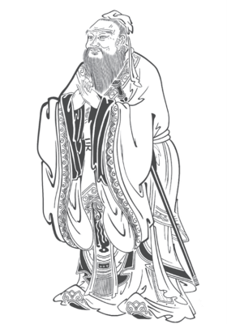

# 논어 손글씨 교본

* (ko) 논어 손글씨 교본
* (zh_TW) 論語筆習敎本
* (en) Handwriting Practice with Confucius

## 목차(目次)

* 해설(解說)
	* [학이(學而)](commentary/01-xue-er.md)
	* [위정(爲政)](commentary/02-wei-zheng.md)
	* [팔일(八佾)](commentary/03-ba-yi.md)
	* [이인(里仁)](commentary/04-li-ren.md)
	* [공야장(公冶長)](commentary/05-gong-ye-chang.md)
	* [옹야(雍也)](commentary/06-yong-ye.md)
	* [술이(述而)](commentary/07-shu-er.md)
	* [태백(泰伯)](commentary/08-tai-bo.md)
	* [자한(子罕)](commentary/09-zi-han.md)
	* [향당(鄕黨)](commentary/10-xiang-dang.md)
	* [선진(先進)](commentary/11-xian-jin.md)
	* [안연(顔淵)](commentary/12-yan-yuan.md)
	* [자로(子路)](commentary/13-zi-lu.md)
	* [헌문(憲問)](commentary/14-xian-wen.md)
	* [위령공(衛靈公)](commentary/15-Wei-Ling-Gong.md)
	* [이씨(李氏)](commentary/16-ji-shi.md)
	* [양화(陽貨)](commentary/17-yang-huo.md)
	* [미자(微子)](commentary/18-wei-zi.md)
	* [자장(子張)](commentary/19-zi-zhang.md)
	* [요왈(堯曰)](commentary/20-yao-yue.md)
	* [연습장(練習帳)](commentary/99-practice.md)
* [다운로드](download/README.md)

## 서문(序文)

모든 것이 컴퓨터와 네트워크를 통해서 이루어지는 정보화 시대. 컴퓨터로 모든 일을 하게 된 오늘날, 가장 큰 타격을 받은 사람은 아마도 꼭 한자(漢子)를 배워야 하는 사람들일 것입니다. 한자는 직접 손으로 쓰지 않고 컴퓨터로 ‘선택하여 입력’하는 방식으로는 익히기 쉽지 않다고 생각합니다.

대학시절 새로 강의를 담당하게 된 어떤 선생님께서 한자를 판서(板書)하다가 어떻게 쓰는 지 기억이 나지 않아 얼굴이 발개지시곤 했던 것이 기억납니다. 당시에 선생님께서는 박사 과정 논문을 쓰고 계셨었고, 너무 오랫동안 컴퓨터로만 한자를 다뤄왔기에 한동안 손으로 한자를 쓰는데 어려움을 겪으셨었지요. 저는 졸업 후 한자와 전혀 관련이 없는 업종에서 일하게 되었고 한자를 직접 쓸 일은 커녕 컴퓨터로 선택하여 입력할 일 조차도 없는 삶을 살아왔어요. 이제는 원래 알던 한자를 보아도 무슨 뜻인지 기억하지 못하는 지경(地境)입니다.

문득 다시 한자를 공부하고 싶다는 생각이 들어 한자 손글씨 교본을 찾아보았으나, 시중에서 찾을 수 있는 것들은 대부분 중국어 또는 일본어를 위한 상용한자(常用漢字) 연습용 교본들 뿐이었습니다. 우리나라는 한글 전용이 대세가 되어서 대부분은 한자를 배우지 않고 그래도 아무런 불편이 없기 때문에 당연한 결과이겠지요. 그렇지만 저는 고전(古典)을 읽고 이해하고 싶어서 한자를 공부하고 싶은 것이라 시판되는 것들이 마음에 들지 않았어요.

그래서 직접 만들기로 결심했습니다.

논어(論語) 원문은 [동양고전종합DB(db.cyberseodang.or.kr)](https://db.cyberseodang.or.kr/)의 [논어집주(論語集註)](https://db.cyberseodang.or.kr/front/alphaList/BookMain.do?tab=tab1_01&bnCode=jti_1h0301&titleId=C2)에서 가져왔으며, 해설은 제가 아는 지식을 최대한 짜내서 직접 작성한 것입니다. 학문적 소양(素養)이 일천(日淺)하여 간신히 뜻을 통하는 수준이므로 유가철학(儒家哲學)과 논어를 공부하려는 목적으로 쓰지 마시고, 필사연습(筆寫練習)을 위한 자료로만 사용하기 바랍니다.

2025년 8월 25일

이대규(李大圭)

## 논어(論語)에 대하여

논어(論語)는 공자(孔子)님과 그의 제자들의 핵심적인 어록(語錄)을 모아놓은 책으로 모든 유학경전(儒學經典)의 가장 오래된 원형(原形)이라고 할 수 있다. 논어는 주장을 설파하는 논증(論證)도 아니고, 이야기를 전달하는 서사(書史)도 아니기 때문에, 구절(句節) 하나하나를 독립적으로 음미(吟味)할 수 있다.

하루에 한두 페이지씩 필사(筆寫) 연습을 하기에 가장 적절한 텍스트라고 할 수 있다.

하지만 이 짤막한 구절에는 2천년이 넘도록 수많은 동아시아(韓中)의 유생(儒生)들이 평생을 바쳐 연구했던 유가철학(儒家哲學)의 정수(精髓)가 담겨있으므로 문맥(文脈)의 뜻을 이해했다고 해서 끝나는 것은 아니다.

논어는 남송(南宋)의 주자(朱子, 주희朱熹, 1,130~1,200)가 주석을 단 “논어집주(論語集註)”가 정석이다. 논어의 더 깊은 뜻을 공부하고 싶다면 논어 또는 논어집주에 대한 해설서를 찾아보기 바란다. 해설서를 한권 선정해서 읽으면서 필사 연습을 병행하는 것도 좋을 듯 싶다.

* [논어, 어떤 주석서를 읽어야 할까? (https://blog.naver.com/hwayli/80105833487)](https://blog.naver.com/hwayli/80105833487)

## 필순(筆順, 획순劃順, 한자를 쓰는 순서)

한자를 쓸 때 획(劃)을 쓰는 순서가 있는데, 나는 어릴 때 서예(書藝)를 배우면서 약간 배웠었지만 지금은 기억도 안 나고 대충 내 마음대로 쓰고 있다. 그 순서는 대체로 아름다운 글씨를 위한 경험적으로 최적화된 권고안(勸告案)이므로 자기 마음대로 써도 상관은 없다.

보통은 위에서 아래로, 왼쪽에서 오른쪽으로 진행되지만, 좌우 대칭인 경우 중간 획을 먼저 쓰는 것이 양쪽의 균형을 잡아서 예쁘게 써질 가능성이 높아진다.

획이 많은 한자의 경우는 쓰다 보면 공간이 부족해질 수 있으므로 공간을 미리 생각하면서 써야 한다.

* [한자 필순(筆順)의 기본원칙 (https://blog.naver.com/osj1952/222146962682)](https://blog.naver.com/osj1952/222146962682)

